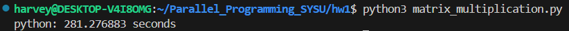

# <center> 并行程序设计与算法实验1

## <center> 莫子昊 22331067

## 1.实验要求

> **问题描述**：随机生成m $\times$ n的矩阵A及n $\times$ k的矩阵B，并对这两个矩阵进行矩阵乘法运算，得到矩阵C.

> **输出**：A,B,C三个矩阵，及矩阵计算所消耗的时间t

> **要求**：实现多个版本的串行矩阵乘法（可考虑多种语言/编译选项/实现方式/算法/库），填写下表，并对比分析不同因素对最终性能的影响。版本内容可参考下表中实现描述。

| 版本 | 实现描述    | 运行时间 (sec.)  | 相对加速比  | 绝对加速比  | 浮点性能 (GFLOPS) | 峰值性能百分比  |
|------|------------|-----------------|------------|------------|-------------------|----------------|
| 1    | Python     |                 |            |            |                   |                |
| 2    | C/C++      |                 |            |            |                   |                |
| 3    | 调整循环顺序|                 |            |            |                   |                |
| 4    | 编译优化    |                 |            |            |                   |                |
| 5    | 循环展开    |                 |            |            |                   |                |
| 6    | Intel MKL  |                 |            |            |                   |                |

## 2.实验内容

### 2.1 CPU性能分析 & 浮点运算总数

本实验使用的测试平台为 Intel® Core™ i7-9750H，规格如下：

| ​**参数**                | ​**值**                          |
|-------------------------|--------------------------------|
| ​**处理器编号**           | i7-9750H                       |
| ​**代号名称**             | Coffee Lake                    |
| ​**光刻**                 | 14 nm                          |
| ​**内核数**               | 6                              |
| ​**总线程数**             | 12                             |
| ​**最大睿频频率**         | 4.50 GHz                       |
| ​**处理器基本频率**       | 2.60 GHz                       |
| ​**发行日期**             | Q2'19                          |

Intel Core i7-9750H 属于 Coffee Lake-HR 架构，支持 AVX2 指令集，但不支持 AVX-512。对于支持 AVX2 的处理器，每周期浮点操作数通常为 8（包括 FMA 操作，因此估计i7-9750H每周期浮点操作数为 8 。由此可得峰值性能估计：


$$Peak=(4.5×10^9)×6×(8×2)=432GFLOPS$$

本实验中，所有矩阵大小均设置为1024x1024，对于每个 C[i][j]，我们需要进行 n 次乘法和 n 次加法（累加）。因此，对于每个 C[i][j]，浮点运算的次数为 2n。

由于矩阵 C 的大小为 $n \times n$，总共有 $n^2$ 个元素需要计算。因此，总的浮点运算次数为 $2n^3$ = $2 \times {1024}^3 =  ​2,147,483,648$  


### 2.2 python峰值性能分析

```
import random
from time import time

n = 1024

A = [[random.random()
      for row in range(n)]
      for col in range(n)]
B = [[random.random()
      for row in range(n)]
      for col in range(n)]
C = [[0 for row in range(n)]
      for col in range(n)]

start = time()
for i in range(n):
    for j in range(n):
        for k in range(n):
            C[i][j] += A[i][k] * B[k][j]
end = time()

print(f"python: {(end-start):.6f} seconds")
```
输出运行时间如下：



$$Peak_{python} = \frac{​2,147,483,648}{281.276883\ s} \approx 7,634,767 \approx 0.0076\ GFLOPS$$

$$\frac{0.0076\ GFLOPS}{432\ GFLOPS} \approx 0.00176\%$$

### 2.3 C++峰值性能分析

```
#include <iostream>
#include <vector>
#include <cstdlib>
#include <ctime>

int main() {
    const int n = 1024; 
    std::vector<std::vector<double>> A(n, std::vector<double>(n));
    std::vector<std::vector<double>> B(n, std::vector<double>(n));
    std::vector<std::vector<double>> C(n, std::vector<double>(n, 0.0));

    std::srand(std::time(0));

    for (int i = 0; i < n; ++i) {
        for (int j = 0; j < n; ++j) {
            A[i][j] = static_cast<double>(std::rand()) / RAND_MAX;
            B[i][j] = static_cast<double>(std::rand()) / RAND_MAX;
        }
    }

    std::clock_t start = std::clock();
    for (int i = 0; i < n; ++i) {
        for (int j = 0; j < n; ++j) {
            for (int k = 0; k < n; ++k) {
                C[i][j] += A[i][k] * B[k][j];
            }
        }
    }
    std::clock_t end = std::clock();

    double elapsed_time = static_cast<double>(end - start) / CLOCKS_PER_SEC;
    printf("C++: %.6lf seconds\n", elapsed_time);

    return 0;
}
```
输出运行时间如下：


$$Peak_{C++} = \frac{​2,147,483,648}{19.269925\ s} \approx 111,442,242 \approx 0.111\ GFLOPS$$

$$\frac{0.111\ GFLOPS}{432\ GFLOPS} \approx 0.0258\%$$

C++ 代码在运行前会被编译成机器码，直接由 CPU 执行，并且 C++ 在编译时确定变量类型，避免了运行时的类型检查开销。而 Python 代码由解释器逐行解释执行，增加了运行时的开销。

### 2.3 C++(调换循环顺序)峰值性能分析

由上课演示的例子可以看出，当循环顺序从外到内为i,k,j时，运行效率最高:

```
#include <iostream>
#include <vector>
#include <cstdlib>
#include <ctime>

int main() {
    const int n = 1024; 
    std::vector<std::vector<double>> A(n, std::vector<double>(n));
    std::vector<std::vector<double>> B(n, std::vector<double>(n));
    std::vector<std::vector<double>> C(n, std::vector<double>(n, 0.0));

    std::srand(std::time(0));

    for (int i = 0; i < n; ++i) {
        for (int j = 0; j < n; ++j) {
            A[i][j] = static_cast<double>(std::rand()) / RAND_MAX;
            B[i][j] = static_cast<double>(std::rand()) / RAND_MAX;
        }
    }

    std::clock_t start = std::clock();
    for (int i = 0; i < n; ++i) {
        for (int k = 0; k < n; ++k) {
            for (int j = 0; j < n; ++j) {
                C[i][j] += A[i][k] * B[k][j];
            }
        }
    }
    std::clock_t end = std::clock();

    double elapsed_time = static_cast<double>(end - start) / CLOCKS_PER_SEC;
    printf("modified loop sequence: %.6lf seconds\n", elapsed_time);

    return 0;
}
```

输出运行时间如下：

.png)

$$Peak_{C++(loop)} = \frac{​2,147,483,648}{12.05667\ s} \approx 178,115,818 \approx 0.178\ GFLOPS$$

$$\frac{0.178\ GFLOPS}{432\ GFLOPS} \approx 0.0412\%$$

调换循环顺序后，由于增加了缓存的命中率，节省了未命中时CPU到内存中去取数据到cache的时间，从而提高了运行的效率。

### 2.4 C++(调换循环顺序+编译优化)峰值性能分析

.png)

| 优化级别 | 描述                  | 运行时间（s）|
| --------|-----------------------|------------|
| O0      | 无优化                 |12.0567     |
| O1      | 基本优化，编译器会尝试减少代码大小和执行时间 | 0.9899 |
| O2      | 更高级的优化，包括循环展开、函数内联等 | 0.6503 |
| O3      | 最高级别优化，可能包括向量化、并行化等激进优化 | 0.4120 |

$$Peak_{C++(loop+compile)} = \frac{​2,147,483,648}{0.412\ s} \approx 5,212,338,951 \approx 5.212\ GFLOPS$$

$$\frac{5.212\ GFLOPS}{432\ GFLOPS} \approx 1.21\%$$

### 2.5 C++(调换循环顺序+编译优化+循环展开)峰值性能分析

```
#include <iostream>
#include <vector>
#include <cstdlib>
#include <ctime>

int main() {
    const int n = 1024; 
    std::vector<std::vector<double>> A(n, std::vector<double>(n));
    std::vector<std::vector<double>> B(n, std::vector<double>(n));
    std::vector<std::vector<double>> C(n, std::vector<double>(n, 0.0));

    std::srand(std::time(0));

    for (int i = 0; i < n; ++i) {
        for (int j = 0; j < n; ++j) {
            A[i][j] = static_cast<double>(std::rand()) / RAND_MAX;
            B[i][j] = static_cast<double>(std::rand()) / RAND_MAX;
        }
    }

    std::clock_t start = std::clock();

    const int unroll_factor = 4; // 展开因子
    for (int i = 0; i < n; ++i) {
        for (int k = 0; k < n; ++k) {
            double A_ik = A[i][k]; // 将 A[i][k] 提取出来，减少内存访问次数
            int j = 0;

            // 主循环展开
            for (; j <= n - unroll_factor; j += unroll_factor) {
                C[i][j] += A_ik * B[k][j];
                C[i][j + 1] += A_ik * B[k][j + 1];
                C[i][j + 2] += A_ik * B[k][j + 2];
                C[i][j + 3] += A_ik * B[k][j + 3];
            }

            // 处理剩余的部分
            for (; j < n; ++j) {
                C[i][j] += A_ik * B[k][j];
            }
        }
    }

    std::clock_t end = std::clock();

    double elapsed_time = static_cast<double>(end - start) / CLOCKS_PER_SEC;
    printf("modified loop sequence and unrolled: %.6lf seconds\n", elapsed_time);

    return 0;
}
```

.png)

对代码进行因子为4的循环展开后，在O3优化下的运行时间并没有明显减少，原因可能是O2/O3优化已经对代码进行了循环展开，所以自己手动进行循环展开并没有太大作用。

$$Peak_{C++(loop+compile+unroll)} = \frac{​2,147,483,648}{0.405\ s} \approx 5,302,428,760 \approx 5.302\ GFLOPS$$

$$\frac{5.212\ GFLOPS}{432\ GFLOPS} \approx 1.23\%$$


### 2.6 C++(MKL)峰值性能分析

```
#include <iostream>
#include <vector>
#include <cstdlib>
#include <ctime>
#include <mkl.h> 

int main() {
    const int n = 1024; 
    std::vector<double> A(n * n);
    std::vector<double> B(n * n);
    std::vector<double> C(n * n, 0.0);

    std::srand(std::time(0));
    for (int i = 0; i < n * n; ++i) {
        A[i] = static_cast<double>(std::rand()) / RAND_MAX;
        B[i] = static_cast<double>(std::rand()) / RAND_MAX;
    }

    std::clock_t start = std::clock();

    cblas_dgemm(CblasRowMajor, CblasNoTrans, CblasNoTrans, 
                n, n, n, 1.0, A.data(), n, B.data(), n, 0.0, C.data(), n);

    std::clock_t end = std::clock();

    double elapsed_time = static_cast<double>(end - start) / CLOCKS_PER_SEC;
    printf("MKL matrix multiplication: %.6lf seconds\n", elapsed_time);

    return 0;
}
```

.png)

Intel MKL是英特尔开发的高性能数学库，专门为 Intel 处理器优化。提供了一系列高效的数学函数，包括：​BLAS（Basic Linear Algebra Subprograms），对矩阵乘法进行了充分的优化。MKL 专门为 Intel CPU 的微架构进行了优化，充分利用了​SIMD 指令集、多核并行和缓存优化等特性。MKL 能够根据硬件和问题的规模动态调整计算策略，例如根据 CPU 的核心数和负载情况，自动调整线程数以最大化性能。


$$Peak_{C++(MKL)} = \frac{​2,147,483,648}{0.104\ s} \approx 20,648,881,230 \approx 20.649\ GFLOPS$$

$$\frac{20.649\ GFLOPS}{432\ GFLOPS} \approx 4.78\%$$

## 3.总结

通过上述实验得到完整性能对比表格如下：

| 版本 | 实现描述      | 运行时间 (sec.)  | 相对加速比  | 绝对加速比  | 浮点性能 (GFLOPS) | 峰值性能百分比(%)  |
|------|--------------|-----------------|------------|------------|-------------------|-------------------|
| 1    | Python       | 281.276         | 1.0        | 1.0        | 0.0076            | 0.00176           |
| 2    | C/C++        | 19.270          | 14.59      | 14.59      | 0.111             | 0.0258            |
| 3    | +调整循环顺序 | 12.056          | 1.6        | 23.33      | 0.178             | 0.0412            |
| 4    | +编译优化     | 0.412           | 29.26      | 682.71     | 5.212             | 1.21              |
| 5    | +循环展开     | 0.405           | 1.02       | 694.51     | 5.302             | 1.23              |
| 6    | Intel MKL    | 0.104           | 3.89       | 2704.58    | 20.649            | 4.78              |
